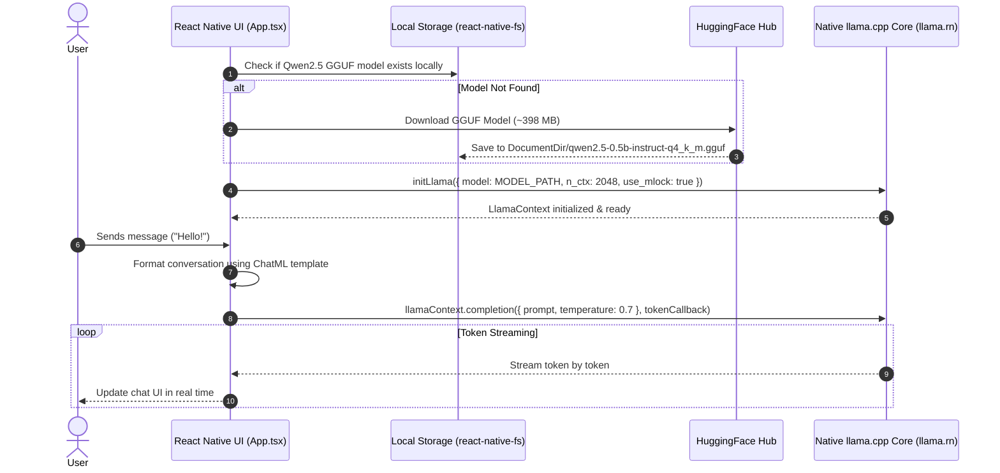

# NativeLLM 🦙

**NativeLLM** is an offline, privacy-first, on-device AI chat application built with React Native. It runs large language models (LLMs) natively on mobile hardware (iOS & Android) without relying on any external cloud APIs or internet connection.

---

## 🌟 Key Features

- **100% Offline & Private**: All inference happens locally on your mobile device. Your data and prompts never leave the phone.
- **On-Device LLM Inference**: Powered by [`llama.rn`](https://github.com/mybigday/llama.rn) (React Native bindings for `llama.cpp`).
- **Hardware Acceleration**: 
  - **iOS**: Metal GPU acceleration.
  - **Android**: Qualcomm Snapdragon Hexagon DSP & OpenCL acceleration.
- **Real-time Streaming**: Response tokens are streamed in real time to the UI.
- **Automatic Model Management**: Automatically downloads and stores model files locally using `react-native-fs`.

---

## 🏗️ System Architecture & Execution Flow



---

## 🛠️ Tech Stack

- **Framework**: React Native (`0.86.0`)
- **Language**: TypeScript / React
- **LLM Engine**: `llama.rn` (bindings for `llama.cpp`)
- **Model**: `Qwen2.5-0.5B-Instruct` (Quantization: `Q4_K_M`, GGUF format)
- **File Management**: `react-native-fs`

---

## 🚀 Getting Started

### Prerequisites

- **Node.js**: `>= 22.11.0`
- **Android Studio**: Android SDK & NDK installed (for Android build)
- **Xcode**: Mac required for iOS builds
- **Physical Device (Recommended)**: For accurate local inference performance testing.

---

### Step 1: Clone & Install Dependencies

```bash
git clone https://github.com/YOUR_USERNAME/NativeLLM.git
cd NativeLLM
npm install
```

---

### Step 2: Start Metro Bundler

```bash
npm start
```

---

### Step 3: Run on Android / Android Studio

#### Option A: Via Command Line
Connect your phone via USB (with USB Debugging enabled) or open an Android Emulator, then run:
```bash
npm run android
```

#### Option B: Via Android Studio
1. Open **Android Studio**.
2. Click **Open** and select the `android/` subfolder in this repository (`NativeLLM/android`).
3. Sync Gradle and click the green **Run 'app' (▶️)** button.

---

### Step 4: Run on iOS

For iOS, install CocoaPods first:

```bash
cd ios && pod install && cd ..
npm run ios
```

---

## 📄 License

This project is open-source and available under the [MIT License](LICENSE).
