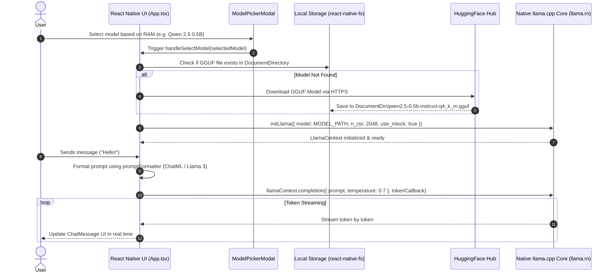

# NativeLLM 🦙

**NativeLLM** is an offline, privacy-first, on-device AI chat application built with React Native. It runs large language models (LLMs) natively on mobile hardware (iOS & Android) without relying on any external cloud APIs or internet connection.

---

## 🌟 Key Features

- **100% Offline & Private**: All inference happens locally on your mobile device. Your data and prompts never leave the phone.
- **On-Device LLM Inference**: Powered by [`llama.rn`](https://github.com/mybigday/llama.rn) (React Native bindings for `llama.cpp`).
- **RAM-Based Model Selector**: Includes a built-in model picker UI allowing users to choose AI models tuned for their phone's RAM (2GB to 8GB+).
- **Hardware Acceleration**: 
  - **iOS**: Metal GPU acceleration.
  - **Android**: Qualcomm Snapdragon Hexagon DSP & OpenCL acceleration.
- **Real-time Streaming**: Response tokens are streamed in real time to the UI.
- **Automatic Model Management**: Automatically downloads and stores model files locally using `react-native-fs`.

---

## 📐 Project Structure & Separation of Concerns

The project follows a clean, modular architecture separating UI components, business logic, styles, types, and model configuration:

```text
e:\Projects\NativeLLM\
├── src/
│   ├── components/
│   │   ├── ChatMessage.tsx          # Render component for user & assistant message bubbles
│   │   └── ModelPickerModal.tsx     # RAM-based model selection & download UI modal
│   ├── constants/
│   │   └── models.ts                # Registry of GGUF models with download URLs & RAM specs
│   ├── styles/
│   │   └── appStyles.ts             # Centralized dark-mode StyleSheet
│   ├── types/
│   │   └── index.ts                 # TypeScript type definitions (Message, ModelOption)
│   └── utils/
│       └── promptFormatter.ts       # Template formatter for ChatML & Llama-3 headers
├── App.tsx                          # Core App controller (state management & llama.rn context)
├── README.md
└── package.json
```

### Module Responsibilities:
- **`App.tsx`**: Main application coordinator managing Llama context initialization, token streaming, download progress, and message state.
- **`src/components/`**: Reusable UI components.
- **`src/constants/models.ts`**: Centralized model registry mapping model identifiers to Hugging Face GGUF direct download endpoints and device requirements.
- **`src/utils/promptFormatter.ts`**: Pure helper utility converting chat history into model-specific prompt templates (`ChatML` vs `Llama 3`).
- **`src/styles/appStyles.ts`**: Isolated React Native stylesheet ensuring UI aesthetics are decoupled from business logic.

---

## 🏗️ System Architecture & Execution Flow



---

## 🤖 Supported Models & RAM Requirements

| Model Name | Size | Recommended RAM | Target Device Tier |
| :--- | :--- | :--- | :--- |
| **SmolLM2 360M** | **229 MB** | **2 GB – 4 GB RAM** | Budget / Entry-level Android phones |
| **Qwen 2.5 0.5B** | **398 MB** | **4 GB – 6 GB RAM** | Mid-range smartphones (Pixel 6a, Galaxy A-series) |
| **TinyLlama 1.1B** | **637 MB** | **6 GB – 8 GB RAM** | Standard mid-to-high end smartphones |
| **Llama 3.2 1B** | **808 MB** | **8 GB+ RAM** | Flagship phones (Galaxy S23/S24, Pixel 8/9, iPhone 15/16 Pro) |

---

## 🛠️ Tech Stack

- **Framework**: React Native (`0.86.0`)
- **Language**: TypeScript / React
- **LLM Engine**: `llama.rn` (bindings for `llama.cpp`)
- **Supported Quantizations**: `Q4_K_M` GGUF models
- **File Management**: `react-native-fs`

---

## 🚀 Getting Started

### Prerequisites

- **Node.js**: `>= 22.11.0`
- **Android Studio**: Android SDK & NDK installed (for Android build)
- **Xcode**: Mac required for iOS builds
- **Physical Device (Recommended)**: For accurate local inference performance testing.

---

### Step 1: Clone & Install Dependencies

```bash
git clone https://github.com/YOUR_USERNAME/NativeLLM.git
cd NativeLLM
npm install
```

---

### Step 2: Start Metro Bundler

```bash
npm start
```

---

### Step 3: Run on Android / Android Studio

#### Option A: Via Command Line
Connect your phone via USB (with USB Debugging enabled) or open an Android Emulator, then run:
```bash
npm run android
```

#### Option B: Via Android Studio
1. Open **Android Studio**.
2. Click **Open** and select the `android/` subfolder in this repository (`NativeLLM/android`).
3. Sync Gradle and click the green **Run 'app' (▶️)** button.

---

### Step 4: Run on iOS

For iOS, install CocoaPods first:

```bash
cd ios && pod install && cd ..
npm run ios
```

---

## 📄 License

This project is open-source and available under the [MIT License](LICENSE).
